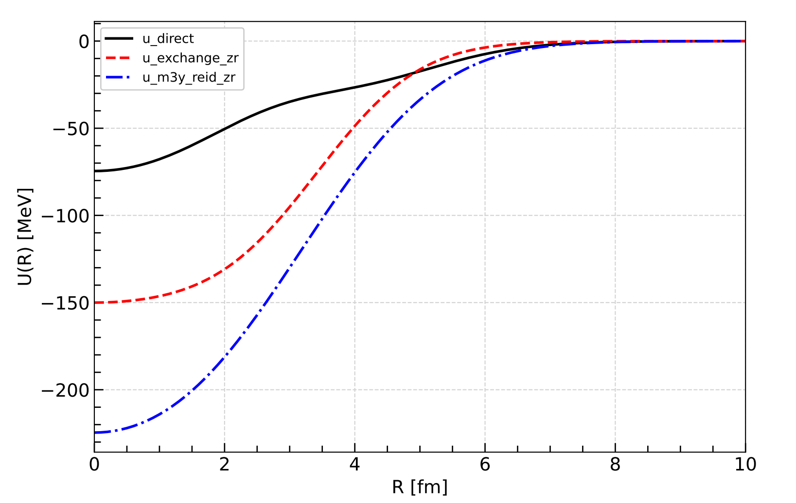

## BiFold: A Python code for the calculation of double folded (bifold) <br> potentials with density-in/dependent nucleon-nucleon interactions

BiFold calculates the density-dependent (DDM3Yn, BDM3Yn, CDM3Yn) or independent double folded potentials between two colliding spherical nuclei. It is written in a Python package form to give the ability to use the potentials directly in a nuclear reaction/structure code. In addition to using Woods-Saxon/Fermi or Gaussian functions, the code also allows for the definition of nuclear matter densities using pre-calculated densities in a data file. 

### Read details
Computer Physics Communications
https://doi.org/10.1016/j.cpc.2022.108613

arXiv.org  
https://doi.org/10.48550/arXiv.2209.13344

### Try without installation

| [mybinder](https://mybinder.org/) | [colab.research](https://colab.research.google.com/) |
|---|---|
| [](https://mybinder.org/v2/gh/mkarakoc/BiFold/HEAD) | [](https://colab.research.google.com/github/mkarakoc/BiFold) |


### Install using pip from pypi.org
```
pip install bifold
```
PyPI link: https://pypi.org/project/bifold/

### Local install
First download the *'current'* folder or clone the BiFold repository. And, open a terminal in *'current'* folder.
Then type to install:
```
pip install .
```

### Example
```Python
from bifold import *

r = mesh(zero, 10, 0.05)  # fm
q = mesh(zero,  3, 0.05)  # fm^-1

e_lab = 141.7 # MeV
a_proj =  4

rho_p = f_2prm_gaussian(r, 0.4229, (1/0.7024)**.5)
rho_t = f_2prm_fermi(r, 0.169, 3.60, 0.523)

u = u_m3y_reid_zr(e_lab, a_proj, rho_p, rho_t, r, q)

title = "a + 40Ca @ Elab = 141.7 MeV using M3Y-Reid/ZR"
plot_potentials(u, r, part="all")
print_all(u, r, q, title=title)
```

### Outputs



```bash
═══════════════════════════════╣a + 40Ca @ Elab = 141.7 MeV using M3Y-Reid/ZR╠═════════════════════════

density/interaction               L          norm        renorm      vol2        vol4            msr
───────────────────────────────────────────────────────────────────────────────────────────────────────
───────total     - - - - - - - - - - - - - - - - - - - - - - - - - - - - - - - - - - - - - - - - - - - 
u_R      : u_m3y_reid_zr          0          None        1.000   -59536.370  -982867.456       16.509 
───────direct    - - - - - - - - - - - - - - - - - - - - - - - - - - - - - - - - - - - - - - - - - - - 
u_R      : u_direct               0          None        1.000   -23281.699  -486747.684       20.907 
rho_p    : f_2prm_gaussian        0          None        1.000        4.000        8.543        2.136 
rho_t    : f_2prm_fermi           0          None        1.000       39.908      461.090       11.554 
vnn      : f_yukawa               0          None        1.000     1570.558      588.970        0.375 
vnn      : f_yukawa               0          None        1.000    -1716.459    -1647.805        0.960 
───────exchange  - - - - - - - - - - - - - - - - - - - - - - - - - - - - - - - - - - - - - - - - - - - 
u_R      : u_exchange_zr          0          None        1.000   -36254.670  -496119.772       13.684 
rho_p    : f_2prm_gaussian        0          None        1.000        4.000        8.543        2.136 
rho_t    : f_2prm_fermi           0          None        1.000       39.908      461.090       11.554 
vnn      : f_dirac_delta          0          None        1.000     -227.114        0.000        0.000 

   R            u_R       	   R            u_R       	   R            u_R       	
 ───────   ───────────────	 ───────   ───────────────	 ───────   ───────────────	
   0.000    -224.563778558	   3.350    -110.244020410	   6.700      -4.355574369	
   0.050    -224.538322266	   3.400    -107.443944653	   6.750      -4.053680997	
   0.100    -224.461928239	   3.450    -104.654310089	   6.800      -3.770556885	
   0.150    -224.334521330	   3.500    -101.877409527	   6.850      -3.505235761	
     ...
     ...
     ...
   3.150    -121.501889365	   6.500      -5.771177508	   9.850      -0.022007393	
   3.200    -118.683529365	   6.550      -5.383970685	   9.900      -0.019983036	
   3.250    -115.866174116	   6.600      -5.019681334	   9.950      -0.018129460	
   3.300    -113.052213657	   6.650      -4.677233004	  10.000      -0.016434605	
```


